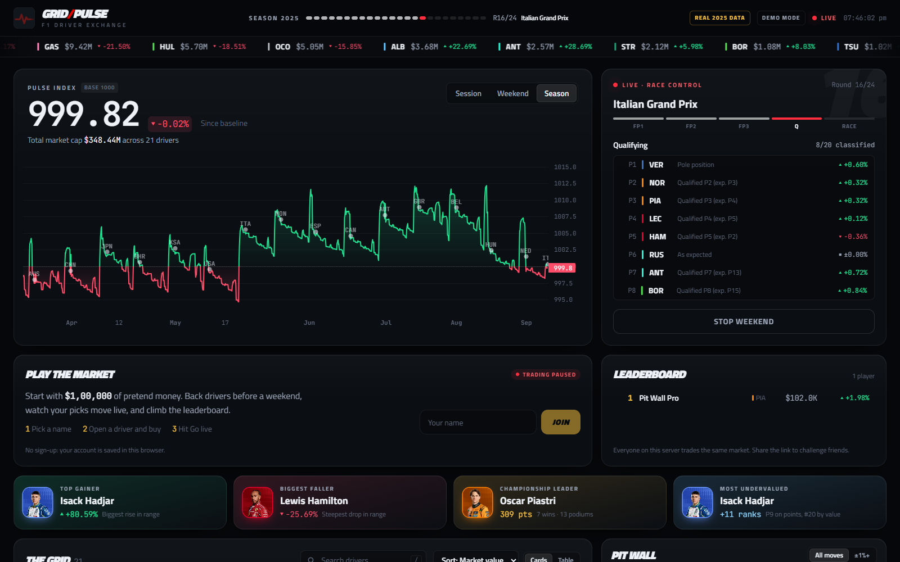
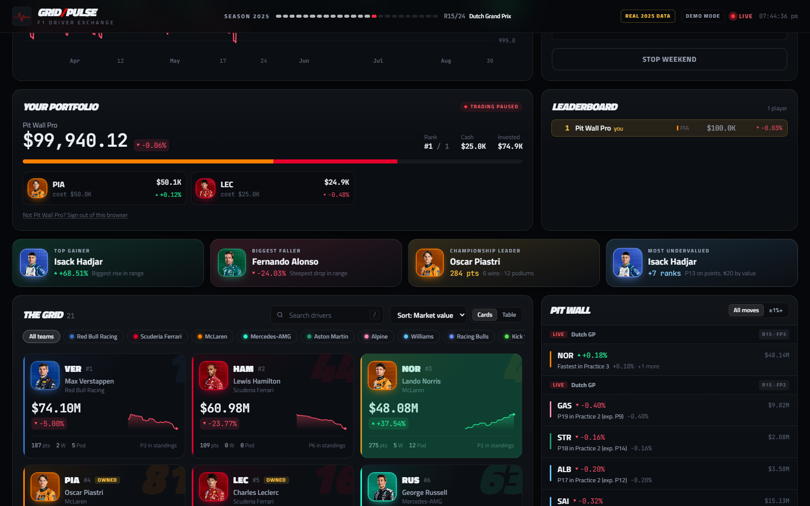

# Grid-Pulse: a real-time stock market for F1 drivers

Grid-Pulse turns Formula 1 drivers into tradeable stocks, priced from the **real 2025 season**. Every driver starts at a baseline valuation (salary + endorsements), and every session of every race weekend moves their price, live, through an **Apache Kafka** pipeline into a trading-terminal dashboard. Then you play the market with pretend money against everyone else on the server.



- **Real results**: the actual 2025 season, fetched with [FastF1](https://github.com/theOehrly/Fast-F1). Rounds 1–14 set the market; **Go live** replays rounds 15–24 session by session, exactly as they happened.
- **The game**: everyone starts with $100,000 of pretend money. Back drivers before a weekend, watch your portfolio move live, and climb a shared leaderboard.
- **Pulse Index**: a cap-weighted index of the whole grid (base 1000), charted across the season.
- **Every move explained**: the Pit Wall feed and driver pages show *why* each price moved ("Qualified P2 (exp. P7) +0.60%", "Retired on lap 52 −1.00%").
- **Constructors heatmap**, a sortable card/table board, stat tiles (top gainer, biggest faller, title leader, most undervalued), and Session / Weekend / Season ranges.



## How prices move

The market *prices in an expectation*: a driver whose stock is the Nth most valuable is expected to finish Nth. Beating that lifts the price, falling short drops it, and headline moments add shocks on top. Expensive drivers therefore have to keep delivering, while a cheap rookie who scores points rallies hard.

| Session | Move |
|---|---|
| Practice | ±0.04% per place vs expectation (capped at ±0.4%), +0.1% for P1 |
| Qualifying | ±0.12% per place (cap ±1.2%), +0.6% pole, +0.2% for P2–P3 |
| Race | ±0.25% per place (cap ±3%), +0.06% per point, +1% win, +0.4% podium, +0.04% per place gained, +0.2% fastest lap |
| Retirement | crash −2.5%, collision −1.5%, other retirements −1% |
| Sprint weekends | sprint qualifying counts 50%, sprint races 40% |

The model lives in [`gridpulse/pricing.py`](gridpulse/pricing.py). The official timing data only says "Retired", not why, so real retirements are priced as plain retirements.

## The game

- Pick a name and you're in. There's no sign-up: the account lives in your browser.
- You invest dollars in a driver, and the holding moves with their price. Buy $10,000 of a driver who rises 5% and it's worth $10,500.
- **Trading pauses while a session is live**, so nobody can read the timing tower and sell before a result is priced.
- Each market reset starts a new season: everyone gets a fresh $100,000.
- Everything is stored in SQLite (`gridpulse.db`, or `GRIDPULSE_DB`).

## Data: real or simulated

| | `--data real` (default) | `--data simulated` |
|---|---|---|
| Rounds 1–14 (history) | actual 2025 results | a generated season |
| **Go live** (rounds 15–24) | replays what really happened | simulates new weekends |
| Files | `generator/real_data/results_2025/` | `generator/historical/generated_historical_results/` |

The real results are committed, so nothing needs downloading. To refresh them run `python generator/real_data/fetch_real_results.py`. It uses FastF1, caches downloads in `.fastf1-cache/`, and is limited to 500 API calls an hour, so a full re-fetch may need two runs. Practice has no official classification, so it's ranked by fastest lap. The same flag, or `GRIDPULSE_DATA=simulated`, works on `dashboard.py`, `producer2.py`, `calculation_service.py` and `generator_real_time.py`.

## Architecture

```
 baseline CSV ──producer1──▶ drivers-baseline-value ─┐
 real / simulated JSON ─producer2─▶ historical-performance-* ─┴─▶ calculation_service ─┐
                                                                                       ├─▶ market-ticks ──▶ dashboard (FastAPI + WebSocket) ──▶ browser
 live weekend ─▶ queue ─producer3─▶ realtime-performance-* ─▶ realtime_service ────────┘      driver-stock-values         game (SQLite)
```

- **`market-ticks` is an event log.** Every price change is a tick carrying its reasons, and each market build starts with an *epoch* record holding the baselines. Replaying the topic rebuilds the market exactly, which is how `realtime_service` and the dashboard recover after a restart.
- **Exactly-once pricing per result.** Each `(round, session, driver)` result is applied at most once per epoch, so re-running a producer or restarting a service never double-counts.
- **Re-runnable batch job.** Running `calculation_service.py` again starts a new epoch; consumers drop the old one automatically.
- **Demo mode** runs the same engine in-process without Kafka, and saves its live weekends to SQLite, so a restart resumes the season.
- `gridpulse/` holds the shared core (roster, calendar, simulator, pricing, engine, game, Kafka helpers) used by every script.

## Quick start (no Kafka needed)

Requires Python 3.10+ and Node 20+.

```bash
git clone https://github.com/sumukhacharya03/Grid-Pulse.git
cd Grid-Pulse
python -m venv .venv && source .venv/bin/activate   # Windows: .venv\Scripts\activate
pip install -r requirements.txt

cd web && npm install && npm run build && cd ..
python dashboard.py --mode demo --open
```

Open http://127.0.0.1:8000, join the game, buy a driver or two, and hit **Go live**.

## Put it online

The `Dockerfile` builds the UI and runs the dashboard in **public mode**, which is demo mode plus guard rails for strangers:
- no instant replays
- a 60-second trading window between weekends
- only the host can stop a weekend or reset before the season ends

```bash
docker build -t grid-pulse .
docker run -p 8080:8080 -v gridpulse-data:/data -e GRIDPULSE_ADMIN_TOKEN=pick-a-secret grid-pulse
```

Keep `/data` on a volume so portfolios survive redeploys. As host, send `X-Admin-Token: <secret>` to `POST /api/simulate/stop` or `POST /api/reset`.

**Fly.io** (config included in `fly.toml`):

```bash
fly launch --copy-config --no-deploy        # pick a unique app name
fly volumes create gridpulse_data --size 1
fly secrets set GRIDPULSE_ADMIN_TOKEN=pick-a-secret
fly deploy
fly scale count 1                           # the market lives in one process: run exactly one machine
```

Any other Docker host works the same way: expose port 8080, mount a volume at `/data`, and run a single instance.

## Full pipeline with Kafka

### 1. Start Kafka

```bash
docker compose up -d      # single-node Kafka (KRaft) on localhost:9092
```

Topics are created automatically, with unlimited retention, the first time any script runs. Set `GRIDPULSE_KAFKA_BROKER` to use a different broker.

### 2. Build the market (one-time batch)

```bash
python baseline_market_value/producer1.py       # baseline values -> Kafka
python generator/historical/producer2.py        # rounds 1-14 -> Kafka
python calculation_service.py                   # prices history, publishes the market
```

Optional: refresh the baseline values with `python baseline_market_value/scraper.py | python baseline_market_value/output.py`. It scrapes Forbes, falling back to saved values when a profile has no figures. For the simulated season, regenerate it with `python generator/historical/generator_historical.py --seed 2025`.

### 3. Run the live services (two terminals)

```bash
python realtime_service.py        # prices live results as they arrive
python dashboard.py               # auto-detects Kafka; http://127.0.0.1:8000
```

### 4. Race

Press **Go live** on the dashboard. It sends the weekend's results to the real-time topics, `realtime_service` prices them, and the ticks stream back to the page. Or drive it from the command line:

```bash
python generator/real_time/generator_real_time.py "Dutch Grand Prix" --weekend   # writes events to the queue
python generator/real_time/producer3.py --exit-when-idle 30                      # ships the queue to Kafka
```

For date-driven automation, run `generator/real_time/schedule_manager.py` daily (cron / Task Scheduler). On a race-weekend date it starts `producer3` (single-instance, exits when idle) and streams that day's sessions. The calendar is the 2025 season, so use `--date 2025-08-30` to try it.

## Development

```bash
pip install -r requirements-dev.txt     # includes FastF1, for refreshing the real data
pytest                                  # model, engine, simulator, real data, game, API

python dashboard.py --mode demo         # backend on :8000
cd web && npm run dev                   # UI with hot reload on :5173 (proxies to :8000)
```

Frontend: React 19 + TypeScript, Vite, Tailwind CSS v4, Motion, and [TradingView Lightweight Charts™](https://www.tradingview.com/lightweight-charts/).

Backend: Python, FastAPI, kafka-python, SQLite, FastF1.

---

A fan project. Pretend money only; not affiliated with Formula 1.
